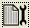

Basic Absorbance
-------------------------------------------

#. Ensure that the spectrometer is plugged into a power outlet.

   .. warning::
      This step must be performed first to avoid damaging the
      instrument.

#. Plug the USB cable from the spectrometer into the computer.

   .. note::
      If you have the newer-model FLAME UV-Vis, make sure to turn on the
      small power switch on the front of the spectrometer.

#. Open OceanView from the desktop (|image|).

#. A Welcome Screen should appear. Click on “Spectroscopy Application
   Wizards”.

   |image1|

#. Select “Absorbance (Concentration)”.

   |image2|

#. Select “Absorbance only” and then Next.

#. Insert a blank cuvette containing either water or the solvent you
   will be using. Make sure the cuvette was cleaned of all fingerprints!

   .. note::
      If your cuvette has frosted sides, be sure that the transparent
      sides are in line with the source and detector.

#. Set your acquisition parameters.

   |image3|

   #. Check the Strobe/Lamp Enable checkbox. This turns on the lamp. You
      should now be able to view the detector input on the right.

   #. Most likely, your input will be saturated. Lower the integration
      time until the entire spectrum fits on the screen. The software
      will give you a message when your spectrometer is in range.

   #. If you notice that your spectrum is “bouncing”, increase the scans
      to average. I recommend a value of “4”.

   #. Click Next.

#. Click the large yellow light bulb to store your reference spectrum.
   This is your 100 % transmittance spectrum. Click Next.

#. Turn off the lamp by unchecking the Strobe/Lamp Enable checkbox.
   Then, click the gray light bulb to store your dark spectrum. This is
   the 0 % transmittance spectrum.

   .. note::
      Remember to turn the lamp back on before clicking Finish!

#. The software should send you to a view window. Note that this is the
   raw detector input. To monitor absorbance, switch to the absorbance
   view by clicking on the tab near the top of the screen.

   |image4|

#. Configure your save data location by clicking the |image5| icon.

   |image6|

   -  Make sure that the file format is “ASCII (with header data)”.

   -  Note the “Target Directory”. This is where your data will be
      saved. You may change this if desired to your own custom folder.
      Just make sure to remember where your data is being saved!

      .. warning::
         Flash memory has a tendancy to fail. Save to the computer first
         and then copy to a USB flash drive.

   -  You can change the format of the filename under Filename
      Decoration.

   -  When you are finished, make sure to click Apply and then Exit.

#. When you have a spectrum you would like to save, press the |image7|
   icon. This icon will turn red and a message “File saving in progress”
   will appear at the bottom of the screen. Make sure that this
   disappears before removing the cuvette with the sample in it!

#. Continue recording spectra as necessary. You may click on the graph
   to obtain the absorbance value at a specific wavelength.

#. When finished, close the software, copy your data to a USB flash
   drive, and close the laptop lid.

