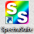
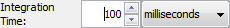

DH-mini Dip Probe
--------------------

.. deprecated:: OceanView
   Since new software was installed to replace the old SpectraSuite, the
   following instructions are outdated. The general setup should still be the
   same.

.. _sec:oostartup:

Startup
^^^^^^^^^^^^^^^^

#. Turn on the power switch on the back of the DH-mini.

#. Push “TTL/Manual” – The LED should turn off indicating that the light
   source is in manual mode.

#. Push “On/Off Deuterium” – The LED should turn on indicating that the
   UV light source is on.

#. Open SpectraSuite from the desktop.

   |image8|

   .. note::
      Minimize “Data Views” section if it is too large.

#. Set the Boxcar averaging to 4 to reduce noise.

#. Immerse the dip probe in your solution. Ensure there are no air
   bubbles in the sensing window.

   -  Swirl your flask vigorously to remove any bubbles.

   -  Position the dip probe so that it does not get hit by the stir
      bar. You may need to angle the probe.

#. Collect a “Dark” spectrum by clicking the dark lightbulb (|image9|) –
   this serves as your 0 %T spectrum.

#. On the DH-mini, push "Open/Close Shutter" – The LED should turn on
   indicating that the shutter is open.

#. Adjust the integration time so that the spectrum is at its maximum
   intensity without being cut off.

   |image10|

#. Close the shutter and retake a dark spectrum.

#. Open the shutter. Once the spectrum is stable, collect a “Light”
   spectrum by clicking the light lightbulb (|image11|) – this serves as
   your 100 %T spectrum.

#. Select absorbance mode (|image12|).

#. Select Strip Chart (|image13|)

   -  Select “Update every scan”

   -  Select “Pause until started by user”

   -  Select “Stop after” and enter 4 minutes.

   -  Change the range to monitor one wavelength: 420 nm

Analysis
^^^^^^^^^^^^^^

#. When ready to collect data, press the start button ().

#. When complete, be sure to save your data.

   #. Click the save icon (|image7|)

   #. Browse to a folder *on the computer*

      .. warning::
         Save to the computer first and *then* to a flash drive. Flash
         drives are prone to errors, so we want to make sure you have a
         backup!

   #. Give the file a recognizable name.

   #. Click save, select the “Trend” you wish to save, then press save
      again.

   #. You should get a message saying that the file was saved. If so,
      close the window.

#. Remove the dip probe and rinse thoroughly with deionized water before
   switching to your new sample.

   When you immerse the probe in your new sample, you should switch back
   to “Graph A” and check to make sure your baseline is at 0. You may
   need to retake your dark and light spectra.

#. Press the “Clear” button and then “Restart trend” to run another
   measurement.

Shutdown
^^^^^^^^^^^^^

#. Ensure all data has been saved to a location *that you can find on
   the computer*.

#. Copy the data from the computer to a USB drive (or email to yourself,
   upload somewhere, …)

#. Push “On/Off Deuterium” to turn off the deuterium lamp.

   .. warning::
      Do not turn off the main power switch. The box must be left powered
      on to cool.

#. Close the SpectraSuite software.

#. Close the lid of the computer.

.. |image7| image:: figures/save.png

.. |image9| image:: figures/dark.png

.. |image11| image:: figures/light.png

.. |image13| image:: figures/stripchart.png
