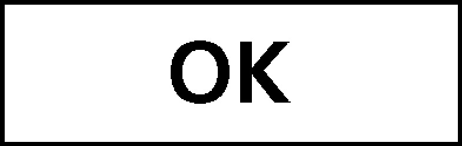
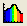
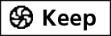
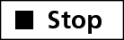

Vernier Spectrometer
==============================================

Getting Started
---------------

#. If not already plugged in and turned on, connect the AC power supply
   to the spectrophotometer. Turn the power switch to the ON position.

#. When the LED for the lamp indicator stays green, connect the
   spectrophotometer to a powered USB port on the computer or a powered
   USB hub.

#. Start Logger Pro 3 software on your computer.

Calibration of Spectrometer
---------------------------

#. To calibrate the spectrophotometer, choose Calibrate > Spectrometer from the
   Experiment menu.  For best results, allow the spectrophotometer to warm up
   for a minimum of ten minutes.

#. Fill a cuvette about ⅔ full with distilled water
   to serve as the blank. After the spectrophotometer has warmed up,
   wipe the sides of the cuvette with a Kimwipe and place the blank
   cuvette in the spectrophotometer. Align the cuvette so the clear side
   of the cuvette is facing the light source. Make sure the water does
   not spill out into the unit and that the line on the cuvette matches
   the notch on the instrument.

#. Follow the instructions in the dialog box to complete the
   calibration, and then click |image|.

Measurement
-----------

#. Click the Configure Configure Spectrometer Data Collection button,
   |image1|. There are three regions in this box, We want the first:

   Collection Mode
      The three options for data collection are offered. If the
      measurement (Absorbance in this example) vs. Time or vs.
      Concentration is selected, a wavelength or wavelengths will need
      to be chosen.

#. Select Absorbance vs. Concentration as the data-collection mode. The
   wavelength where our compound absorbs the most light
   (λ\ :sub:`max` = 562 nm) will need to
   be selected in the list to the right. Make sure all other wavelengths
   are unselected.

#. Click |image| to continue.

#. Click |image2|. Place your first sample in the cuvette slot of the
   Spectrophotometer. After the readings stabilize, click |image3|.
   Enter the concentration of the sample and click |image|.

#. Place your second sample in the cuvette slot. After
   the readings stabilize, click |image4|. Enter the concentration of
   the second sample and click |image|.

#. Repeat the previous step for the remaining
   samples. When finished, click |image5| to end data collection.

#. The data may be copied from the spreadsheet and pasted directly into
   Excel for analysis. For unknown measurements, place the cuvette
   containing an unknown in the spectrometer and write the absorbance
   value down in your notebook. Use the trendline to determine unknown
   concentrations.

